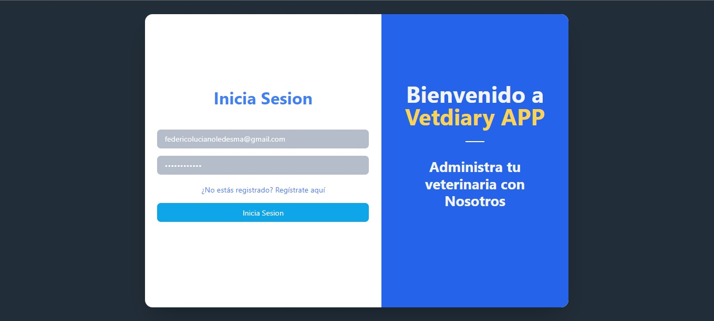
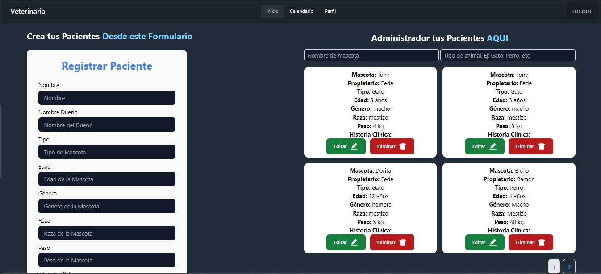
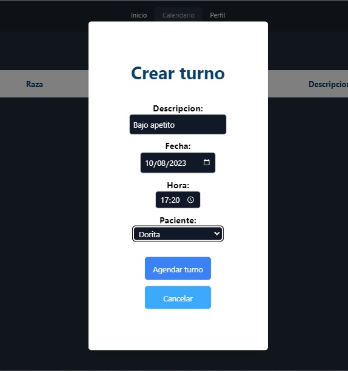
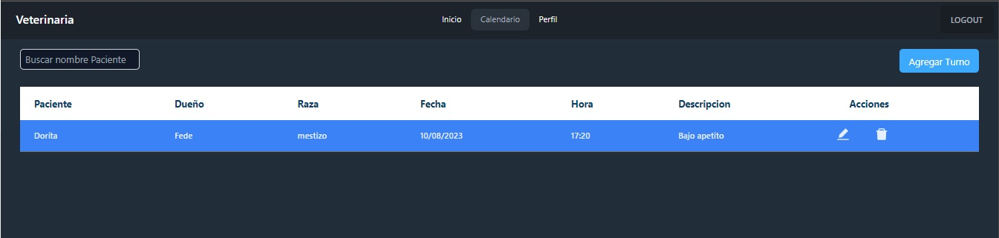
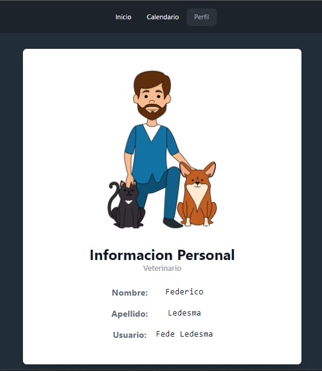

# 🐶 *Proyecto VETERINARIA* 😺

<div style = "text-align:center">
   
   
</div>


## Descripción del Proyecto 📃

*Este proyecto se trata de un sistema de gestion de turnos para una veterinaria. Cada uno de sus medicos tendra su propio perfil, podra registrar sus pacientes y tambien gestionar sus turnos para un mayor control y facilidad al realizarlos.*

## Requisitos del proyecto ✅
- Poseer un mínimo de 3 vistas en la SPA.
- Implementar y utilizar como mínimo los hooks: useState, useEffect, useRef y
useContext.
- Implementar y manejar un estado global con Zustand.
- Utilizar React Router Dom v6.14.
- Diseño responsive para mobile y desktop.
- Código limpio, formateado y documentado de ser necesario.
- Entrega dentro del límite de tiempo.

## Tecnologías utilizadas
- React
- JavaScript
- Tailwind
- CSS
- Node.js

## Imagenes del proyecto 📷
<div style = "text-align:center">
   
   
   
   
</div>

## Para clonar el repositorio 💻

```bash
git clone https://github.com/spawn22/proyect-veterinario.git
```
>**COMO EJECUTAR EL PROYECTO:** 
- Abrimos una terminal con la direccion del repositorio clonado.
- Ejecutamos: npm install
- Accedemos al backend con: cd back
- npm run dev
- Iniciamos una conección desde mongoCompass
- En la terminal: cd .. , cd front
- npm run dev

## Sitio Web 💻
Link del proyecto deployado: https://proyect-veterinario.vercel.app/
### Autores 💻
+ Lucas Ruiz [GitHub](https://github.com/spawn22)
+ Federico Luciano Ledesma [GitHub](https://github.com/Fedreric)
+ Alejandro Isa [GitHub](https://github.com/alejandroisa71)
